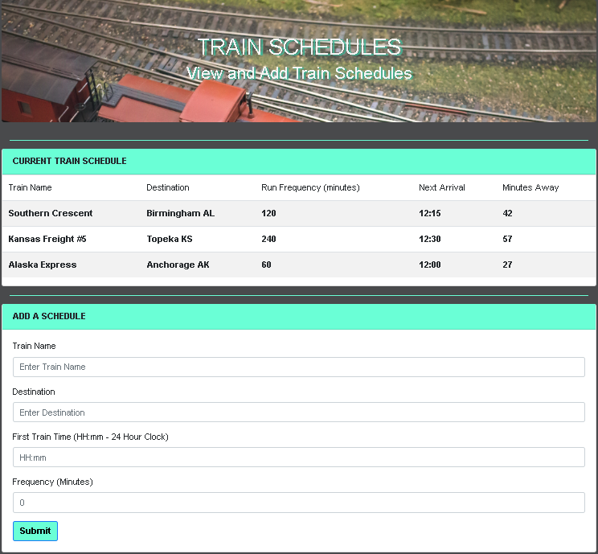

# Train-Scheduler

### Overview

This is an online train schedule application that incorporates Firebase to host arrival and departure data. The app will retrieve and manipulate this information with Moment.js. This website will provide up-to-date information about various trains, namely their arrival times and how many minutes remain until they arrive at their station.

### Technologies Used

JavaScript, JQuery, and Firebase database.

### Screenshot

https://billysterling.github.io/Train-Scheduler/